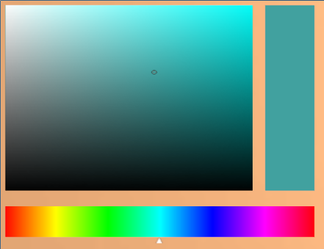

# Color Picker

This small project fills a gap in the large area of color picker tools. Indeed, there are a lot of them, but none met my needs, or not all in one tool:
* Using a separate hue bar instead of the brightness bar, making color choosing easier in my opinion
* Giving user feedback about the current selection with cursor on the central picker and the side bar
* Only one prim object with included cursors and preview color (needing mesh)
* Easy to integrate and use (plug and play)
* Talk with RGB or HSV in both direction

Those needs correspond to the features I developped in this tool. Of course I got ideas and some code from others in the opensource community. From the header of the script:

>  Made with love, wanting the optimal color picker, one mesh object, optimized script, self contained.
>  * Thanks to Cheetos Brat for the face params work on the mesh object
>  * Slider texture offset idea borrowed Chimera Firecaster (and by her Nova Convair)
>  * HSV/RGB conversion functions adapted from Sally LaSalle (http://wiki.secondlife.com/wiki/Color_conversion_scripts)

## How it looks like?



The contour is not part of the object itself. I have added a background so that it does not looks like separate parts. But it's really aimed to be integrated with another object (a linkset, most probably a HUD).

The big central part is the saturation/value picker, where you fine choose on a previously selected color on the hue bottom bar. On the right of it, you have the preview pane, with a flat rectangle of the currently selected color.

For both bars, you have a cursor indicating from where your current color comes from on the panels.

## Where is the mesh object?

If you can't find the object in world, this source project contains both [*.blend*](Mesh/ColorPicker.blend) (Blender) and [*.dae*](Mesh/ColorPicker.dae) (Collada) files. Import the *.dae* with your viewer (if you know how to import mesh), making the two lowest LOD to `0` and no physics (this reduces rendering cost).

You will also need the textures (to import) to put on different faces of the mesh:
* [Central gradient panel](Images/BSgradient.png) on face **1**
* [Picker cursor](Images/PickerCircle.png) on face **3**
* [Hue bar](Images/HueBar.png) on face **2**
* [Hue Slider cursor](Images/HueSlider.png) on face **5**

> Note that you also have the *.xcf* (The Gimp) files for each texture.

Then you can drop the [script](Scripts/ColorPicker.lsl) (without the *.lsl* extension) in the object to put it alive.

## How to use it?

1. link the picker to your build (hud)
2. communicate with it through link messages
3. that's all :)

## What's the ColorPicker language?

The picker accepts in input only setting some options that you can group in one message if you want (separate options with a ~):
```lsl
llMessageLinked(link_number_of_picker, 0, options, (key)"ColorPicker");
```

You always give `0` for the *number* part, and `ColorPicker` for the *key* part. The *string* part contains the options, which can be:
* `rgb=<RGB vector>` send a new (or initial) color by its RGB (LSL) vector
* `hsv=<HSV vector>` send a new (or initial) color by its HSV (Hue/Saturation/Value) vector
* `sliderColor=<RGB vector>` (white by default - `<1, 1, 1>`) set a color for the hue slider at the bottom
* `public=1` or `0` (`0` by default) allow anyone to manipulate the picker when rezzed on a region
* `selectOnly=1` or `0` (`0` by default) send a message only when a color is selected (not while dragging)
* `sendHSV=1` or `0` (`0` by default) ask the color sent by the picker is inthe HSV format (RGB by default)
* `sendTo=linkNumber` or `-1` (`-1` by default - all links) ask the picker to send messages to a specific link, or all links in the linkset

Examples:
```lsl
llMessageLinked(pickerLink, 0, "rgb=<1,1,1>", (key)"ColorPicker");
```

```lsl
llMessageLinked(pickerLink, 0,
  "rgb=<1,1,1>~sendHSV=1~public=1~selectOnly=1", (key)"ColorPicker");
```

The picker will send messages to the asked link (`sendTo` option) or all links.
* The *key* part will always be `ColorPicker` (as asked in input)
* The *number* tells the reason of the message:
  - `-1`  user is dragging the cursors and `selectOnly=0`
  - `1`   user selected a color (end of drag or just touched)
  - `2`   user clicked the color preview part
* The *string* part will be the actual color in a LSL vector format, representing the RGB values (by default) or HSV values (if `sendHSV=1`)

The external script can also request the current color by sending a message with `3` in the number. The picker will reply with `-3` in the number, and the color in the string part, in the format specified by the options (RGB by default).
